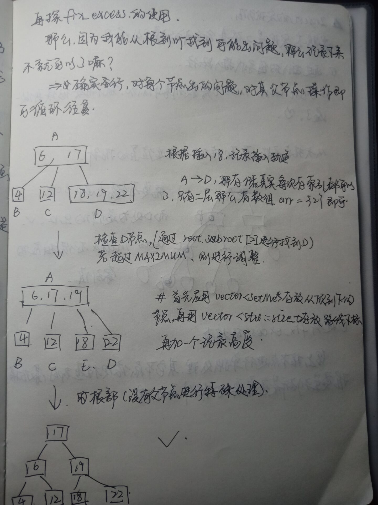
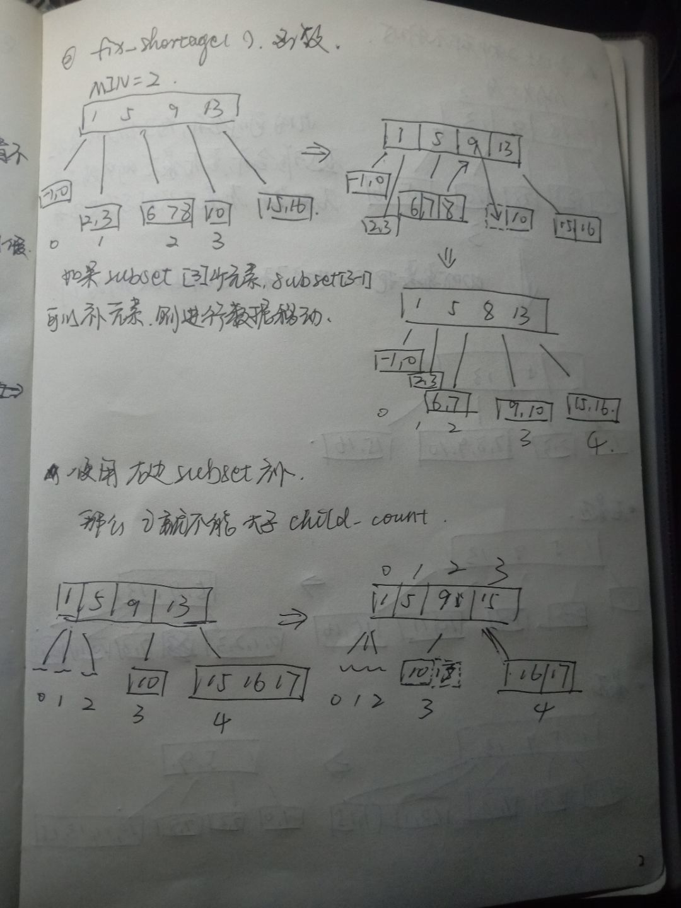
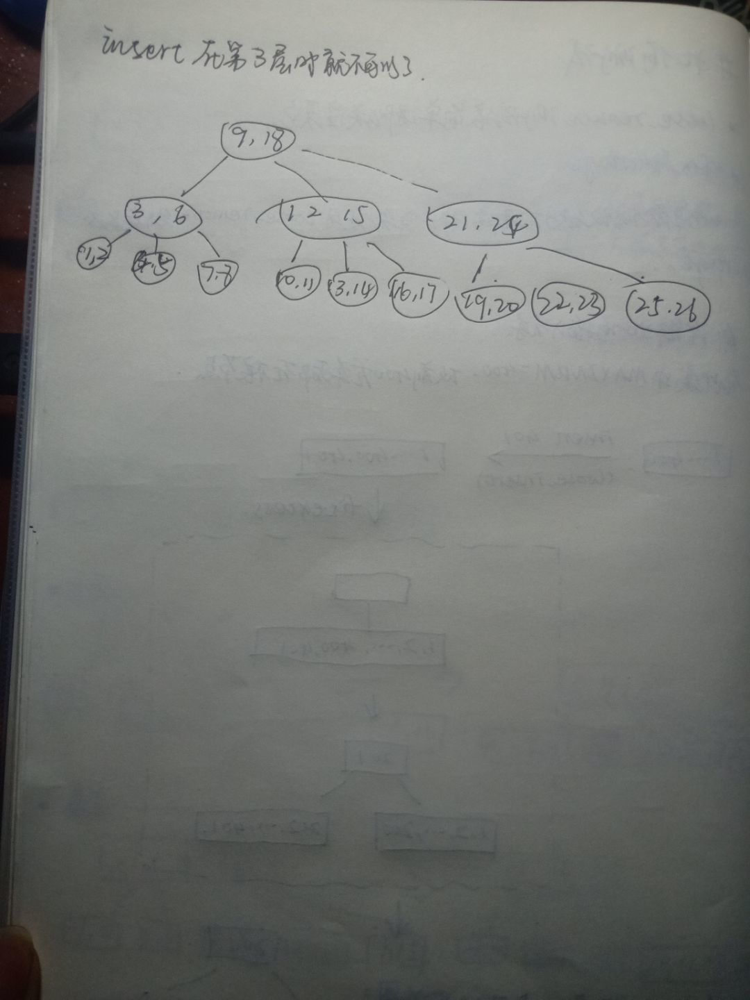

# B-Tree
## insert方法的一些记录：





# remove
记录remove的一些思路：
  
    

  
  


# 如何测试：
----
测试的时候各种问题都会出现，记录一些测试心得在这里。

 


## 解决Show函数的换行问题
对于一个MAXIMUM=4的B-Tree来说Show函数输出以下内容并不是很友好，因为不能明显的表现出树各节点的关系。
```
27 54
9 18 --|||--36 45 --|||--63 72 81 90
3 6 --|||--12 15 --|||--21 24
30 33 --|||--39 42 --|||--48 51
48 51 --|||--57 60 --|||--66 69 --|||--84 87 --|||--93 96
1 2 --|||--4 5 --|||--7 8
10 11 --|||--13 14 --|||--16 17
16 17 --|||--19 20 --|||--22 23
22 23 --|||--28 29 --|||--31 32
31 32 --|||--37 38 --|||--40 41
40 41 --|||--46 47 --|||--49 50
40 41 --|||--46 47 --|||--49 50
49 50 --|||--55 56 --|||--58 59
58 59 --|||--64 65 --|||--67 68
67 68 --|||--82 83 --|||--85 86
85 86 --|||--91 92 --|||--94 95 99
```

